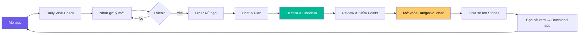
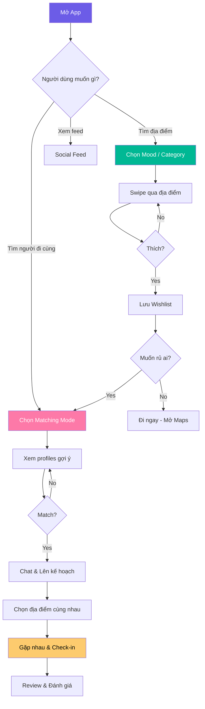
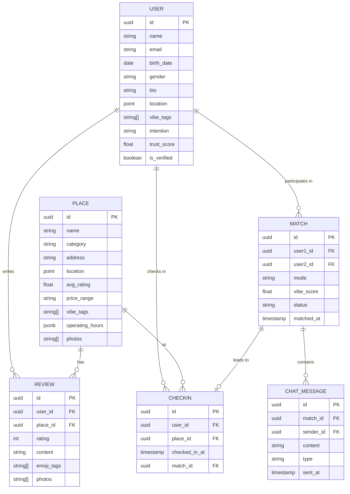
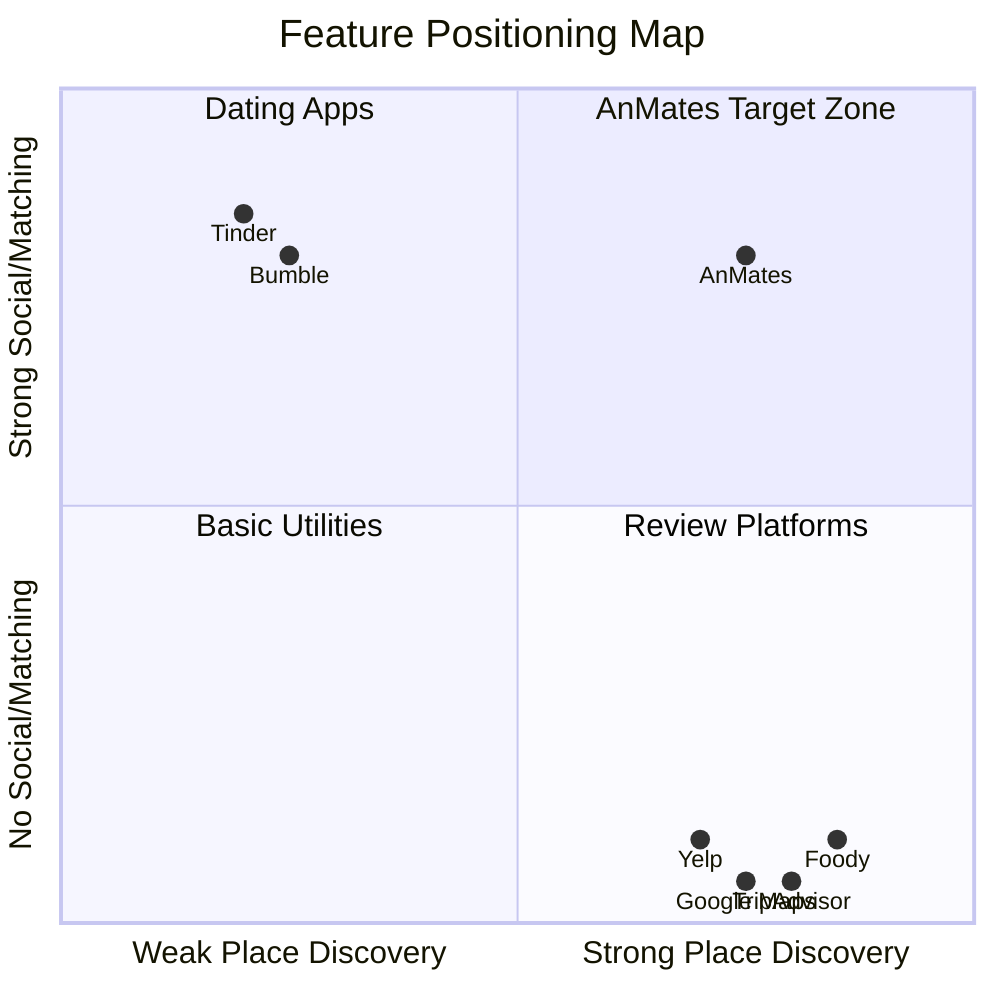
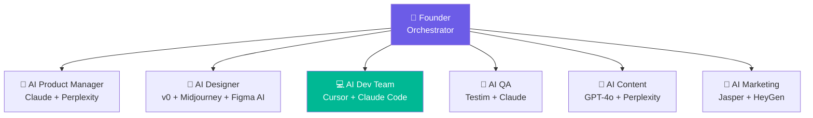

# 🎯 Product Plan: AnMates — Ứng dụng Khám phá & Kết nối

> **Tagline:** *"Khám phá địa điểm. Kết nối con người. Tạo kỷ niệm."*

## 1. Tổng quan sản phẩm

**AnMates** là ứng dụng mobile kết hợp hai trải nghiệm chính:
- **Discover** — Gợi ý địa điểm ăn uống, xem phim, giải trí dựa trên sở thích, vị trí, mood và ngân sách của người dùng
- **Match & Meet** — Matching với người lạ có cùng sở thích để đi chơi, khám phá hoặc hẹn hò

Điểm khác biệt: Không chỉ là app hẹn hò hay app review — AnMates tạo ra **trải nghiệm end-to-end** từ "muốn đi đâu đó" → "tìm người đi cùng" → "lên kế hoạch" → "đi chơi thật".

---

## 2. Target Users

| Segment | Mô tả | Pain Point |
|---------|--------|------------|
| 🎓 **Gen Z (18-25)** | Sinh viên, người mới đi làm | Muốn khám phá nhưng không biết đi đâu, thiếu bạn đi cùng |
| 💼 **Young Professionals (25-32)** | Dân văn phòng, người mới chuyển đến thành phố | Bận rộn, ít thời gian tìm hiểu, muốn kết nối ngoài công việc |
| 🌍 **Expats & Travelers** | Người nước ngoài sống/du lịch tại VN | Language barrier, không biết local spots |
| 💑 **Couples** | Các cặp đôi | Hết ý tưởng date, muốn trải nghiệm mới |

**Primary Market:** TP.HCM & Hà Nội (mở rộng sau)

---

## 3. Core Features

### 3.1 🗺️ Module: DISCOVER (Khám phá địa điểm)

#### 3.1.1 Smart Suggestion Engine
- **Mood-based Discovery:** Người dùng chọn mood hiện tại → App gợi ý phù hợp
  - 🍜 "Đói bụng" → Nhà hàng, quán ăn, street food
  - 🎬 "Chill" → Rạp phim, quán cafe, rooftop bar
  - 🎮 "Năng động" → Board game, karaoke, escape room, bowling
  - 🌿 "Thư giãn" → Spa, yoga, công viên, hiking spots
  - 🎉 "Party" → Club, bar, live music venues

- **Smart Filters:**
  - 📍 Khoảng cách (trong vòng 1km, 3km, 5km, 10km)
  - 💰 Ngân sách (dưới 100k, 100-300k, 300-500k, 500k+)
  - ⭐ Rating (4.0+, 4.5+)
  - 🕐 Giờ mở cửa (đang mở / mở tối nay / mở cuối tuần)
  - 👥 Phù hợp cho (1 người, nhóm bạn, date, gia đình)

#### 3.1.2 Swipe to Explore
- Giao diện **swipe card** cho địa điểm (giống Tinder nhưng cho places)
- Swipe phải → Lưu vào wishlist
- Swipe trái → Bỏ qua
- Swipe lên → Xem chi tiết
- **Super Like** → Đánh dấu "must-go"

#### 3.1.3 Place Detail Page
- Ảnh/video đẹp (user-generated + curated)
- Thông tin cơ bản (địa chỉ, giờ mở cửa, giá trung bình, SĐT)
- Reviews từ cộng đồng AnMates (ngắn gọn, có ảnh)
- **"Vibe Check"** — Đánh giá nhanh bằng emoji tags (Romantic 💕, Instagrammable 📸, Quiet 🤫, Lively 🎉)
- Nút **"Đi ngay"** → Mở Google Maps / Grab
- Nút **"Rủ ai đi cùng?"** → Chuyển sang module Match

#### 3.1.4 Curated Collections
- "Date Night Ideas under 500k" ❤️
- "Best Rooftop Bars in Saigon" 🌃
- "Hidden Gems Quận 1" 💎
- "Rainy Day Activities" 🌧️
- Collections do editorial team + AI + community tạo

#### 3.1.5 AI Trip Planner
- Nhập: "Tối nay muốn đi chơi 2 người, budget 500k, thích ăn Nhật"
- Output: Lịch trình gợi ý (ví dụ: 6pm Sushi → 8pm Cafe → 9:30pm Rooftop Bar)
- Có thể chỉnh sửa, lưu, chia sẻ

#### 3.1.6 🌗 Adaptive Theme Engine (Auto đổi màu)
- **Theo thời gian ngày:**
  - 🌅 Sáng (6-11h): Tông ấm, sáng — Sunrise Amber
  - ☀️ Trưa (11-17h): Tông tươi, năng động — Ocean Blue
  - 🌆 Chiều tối (17-20h): Tông sunset — Sunset Orange
  - 🌙 Đêm (20-6h): Tông tối, neon — Purple Pink / Midnight
- **Theo vị trí/context:**
  - 🏖️ Gần biển (Đà Nẵng, Nha Trang): Ocean Blue tự động
  - 🏔️ Vùng cao (Đà Lạt, Sapa): Emerald Green
  - 🏙️ Thành phố (HCM, HN): Purple Pink hoặc Cherry
  - 🌿 Gần công viên/thiên nhiên: Emerald Green
- **Theo thời tiết (Weather API):**
  - ☀️ Nắng → Sunset Orange
  - 🌧️ Mưa → Ocean Blue (cool tones)
  - 🌙 Trời trong, đêm → Midnight
- User có thể **override** bằng manual picker, hoặc **lock** theme yêu thích

---

### 3.2 💫 Module: MATCH & MEET (Kết nối & Hẹn hò)

#### 3.2.1 Profile Setup
- **Basic Info:** Tên, tuổi, giới tính, nghề nghiệp, bio ngắn
- **Ảnh:** 3-6 ảnh (khuyến khích ảnh đời thường, có verification badge)
- **Vibe Tags:** Chọn tối đa 10 tags sở thích
  - 🍕 Foodie | 🎬 Movie Buff | 🎵 Music Lover | 🏃 Sporty
  - 📚 Bookworm | 🎮 Gamer | ☕ Coffee Addict | 🌏 Traveler
  - 🎨 Art Lover | 🍺 Social Drinker | 🐶 Pet Parent | 🧘 Wellness
- **Availability:** Chọn khung giờ rảnh trong tuần
- **Intention:** Tìm bạn đi chơi 👋 | Hẹn hò 💕 | Cả hai ✨

#### 3.2.2 Matching Algorithm
- **Vibe Score:** Tính % tương thích dựa trên:
  - Sở thích chung (Vibe Tags overlap)
  - Vị trí gần nhau
  - Availability trùng khớp
  - Intention phù hợp
  - Lịch sử địa điểm đã like (thích cùng quán = bonus)

- **Matching Modes:**

  | Mode | Mô tả | Use Case |
  |------|--------|----------|
  | 🎲 **Random Vibe** | Match ngẫu nhiên người gần đây có cùng mood | Spontaneous, muốn đi ngay |
  | 🎯 **Activity Match** | Match theo hoạt động cụ thể (ví dụ: "Ai muốn xem phim tối nay?") | Có plan cụ thể |
  | 👥 **Group Hangout** | Tạo/join nhóm đi chơi (3-8 người) | Đi nhóm, giảm áp lực 1:1 |
  | 💕 **Date Mode** | Matching 1:1 kiểu hẹn hò, profile detail hơn | Romantic interest |

#### 3.2.3 Chat & Plan
- **Chat** sau khi match (text + voice message + GIF/sticker)
- **Quick Plan:** Gợi ý địa điểm ngay trong chat
  - "Hai bạn đều thích ăn Nhật! Thử quán Sushi Hokkaido gần đây nhé? 🍣"
- **Shared Calendar:** Chọn ngày giờ hẹn
- **Split Bill Calculator:** Chia bill sau buổi đi chơi

#### 3.2.4 Safety Features (CỰC KỲ QUAN TRỌNG)

> [!CAUTION]
> An toàn người dùng là ưu tiên số 1 cho tính năng matching với người lạ

- **Photo Verification:** Selfie check real-time (AI face matching)
- **ID Verification (optional):** Xác thực CCCD để có badge "Verified" ✅
- **Share Location:** Chia sẻ vị trí real-time với bạn bè/người thân khi đi gặp
- **SOS Button:** Nút khẩn cấp → Gọi 113 + gửi location cho emergency contacts
- **Report & Block:** Báo cáo hành vi xấu, block tức thì
- **Meeting Point Suggestion:** Chỉ gợi ý gặp ở nơi công cộng, đông người
- **Post-Meet Feedback:** Đánh giá lẫn nhau sau buổi gặp (ảnh hưởng trust score)
- **AI Content Moderation:** Scan chat cho inappropriate content

---

### 3.3 🏆 Module: SOCIAL & GAMIFICATION

#### 3.3.1 AnPoints & Rewards
- Kiếm points khi: Check-in, viết review, match thành công, refer bạn bè
- Đổi points → Voucher nhà hàng, vé xem phim, discount Grab,...
- **Leaderboard** theo khu vực

#### 3.3.2 Achievements & Badges
- 🏅 "Foodie Explorer" — Check-in 20 nhà hàng khác nhau
- 🏅 "Social Butterfly" — Match thành công 10 lần
- 🏅 "Night Owl" — Check-in 5 địa điểm sau 10pm
- 🏅 "Hidden Gem Hunter" — Là người đầu tiên review 3 địa điểm mới


---

### 3.4 🔁 Module: USER RETENTION WORKFLOW (Giữ chân người dùng)

> [!IMPORTANT]
> Mục tiêu: Tạo một hệ sinh thái khép kín khiến user KHÔNG CẦN rời app sang Zalo, Messenger, Google Maps, hay bất kỳ app nào khác.

#### 3.4.1 AnMates Chat — Thay thế Zalo/Messenger
- **Full messaging:** Text, voice message, video call HD, GIF, stickers, reactions
- **Group chat** cho nhóm đi chơi (tự tạo từ Group Hangout)
- **Smart Suggestions:** Bot tự gợi ý địa điểm dựa trên nội dung chat (Hỏi người biết về AI)
  - "Hai bạn nhắc đến sushi → Gợi ý: Sushi Hokkaido ⭐ 4.8, cách 0.8km"
- **Shared Picture:** Chia sẻ ảnh check-in
- **Mini-games trong chat:** Truth or Dare, 20 Questions, This or That, Would You Rather — phá băng dễ dàng
- **Chat Streaks:** Duy trì streak nhắn tin hàng ngày → bonus AnPoints (giống Snapchat)
- **Read receipts + Online status** → Tạo cảm giác presence, FOMO

#### 3.4.2 In-App Services — MVP Scope

> [!NOTE]
> MVP chỉ tập trung vào các tính năng cốt lõi, không tích hợp third-party payment hay booking.

- **Thông tin địa điểm** — Xem địa chỉ, số điện thoại của quán ăn, nhà hàng, chỗ vui chơi, rạp phim
- **Đặt lịch hẹn & Nhắc nhở** — Hai người sau khi match có thể đặt lịch hẹn đến một địa điểm, app gửi push notification nhắc nhở trước giờ hẹn
- **Review & Check-in** — Viết review ngay tại chỗ sau khi đến, kiếm AnPoints
- **Redirect Maps** — Nút "Chỉ đường" mở Google Maps app với địa chỉ đích đến

#### 3.4.3 Engagement Loops — Lý do quay lại mỗi ngày



- **Daily Vibe Check (09:00):** Mỗi sáng gợi ý 3 địa điểm mới theo mood → Tạo thói quen mở app
- **Lunch Roulette (11:30):** "Trưa nay ăn gì?" → Random gợi ý quán gần công ty
- **Evening Match (18:00):** "Tối nay rảnh không? 3 người gần bạn cũng đang rảnh!" 
- **Weekend Planner (Thứ 6, 15:00):** AI gợi ý lịch trình cuối tuần
- **Flash Deals (Random):** Voucher giảm giá limited-time → Tạo urgency mở app (Coming-soon)

#### 3.4.4 Social Hooks — Kéo user quay lại
- **"Ai đó đã like bạn!"** → Push notification → Mở app xem
- **Match Expiry (24h):** Match sẽ hết hạn nếu không chat trong 24h → Urgency
- **Streak Rewards:** Chat streak 7 ngày liên tiếp = 1 Super Like miễn phí
- **Weekly Recap:** Email/notification tóm tắt tuần: "Bạn đã check-in 3 nơi, match 2 người mới!"
- **Friend Activity:** "Linh vừa check-in tại Cafe ABC" → FOMO → Mở app
- **Vibe Stories:** Stories 24h (giống IG) — cần mở app để xem trước khi hết hạn
- **Secret Message & View Once:** Tin nhắn / hình ảnh bí mật chỉ xem được 1 lần duy nhất — mở khóa khi chat streak ≥ 3 ngày liên tiếp

---

#### 🔐 Secret Message & View Once — Chi tiết tính năng

##### Behavior Flow

```
Người gửi                        Người nhận
    │                                  │
    ├─ Giữ nút gửi → chọn 🔒          │
    │   "Secret Mode"                  │
    ├─ Gửi text / ảnh / video ────────►│
    │                             [Nhận tin]
    │                             Hiện badge 👁️ + viền tím nhấp nháy
    │                             Label: "Tin bí mật • Chỉ xem 1 lần"
    │                                  │
    │                             [Bấm giữ để xem]
    │                             → Fullscreen tối, blur background
    │                             → Haptic feedback (rung nhẹ)
    │                             → Không thể screenshot / screen record*
    │                             → Đếm ngược 10 giây (text) / phát 1 lần (ảnh/video)
    │◄── Notify "👁️ [Tên] đã xem" ────┤
    │                             → Tin biến mất, chỉ còn:
    │                               "🔒 Tin bí mật • Đã xem lúc 20:17"
```

##### 3 lớp bảo vệ

| Lớp | Cơ chế | Kết quả |
|-----|--------|---------|
| **Screenshot Detection** | iOS `UIScreen.isCaptured` / Android `FLAG_SECURE` | Notify người gửi ngay: `"[Tên] đã chụp màn hình 📸"` |
| **Screen Recording Block** | Blur / đen toàn màn hình khi detect recording | Nội dung không capture được |
| **Server-side Deletion** | Xóa media khỏi server sau khi `ViewOnceState = .seen` | Không thể recover dù hack client |

##### UX Details

- **Icon riêng biệt:** 👁️ màu tím — khác hoàn toàn tin thường → tạo tò mò
- **Haptic khi mở:** Rung pattern đặc biệt — cảm giác "mở phong bì bí mật"
- **Fullscreen mode:** Tối màn hình, blur chat phía sau — tập trung hoàn toàn
- **Không thể:** Copy text · Forward · Star/Bookmark · Share
- **Sau khi xem:** Label `"🔒 Đã xem"` thay thế nội dung — cả 2 bên đều thấy

##### Trigger & Reward (Social Hook)

- Mở khóa sau **chat streak 3 ngày** → tạo động lực duy trì streak
- Push notify người gửi khi tin được xem → **kéo họ quay lại chat ngay**
- Tạo **FOMO & hồi hộp** cho cả 2 phía — đặc biệt phù hợp giai đoạn đầu match mới

---

#### 🛡️ AI Content Moderation — Ngăn chặn nội dung đồi truỵ

> [!CAUTION]
> Tính năng View Once / Secret Message **đặc biệt dễ bị lạm dụng** để gửi nội dung không phù hợp. Moderation là bắt buộc trước khi tin được hiển thị cho người nhận.

##### Flow kiểm duyệt ảnh/video trước khi gửi

```
[User gửi ảnh/video]
        │
        ▼
[Upload lên server]
        │
        ▼
[AI Scan — < 500ms]
   ├─ NSFW Detection (nudity, sexual content)
   ├─ Violence / Gore Detection  
   ├─ CSAM Hash Matching (PhotoDNA / Google SafeSearch)
   └─ Face Detection (nhận diện minor)
        │
   ┌────┴────┐
CLEAN      FLAGGED
   │            │
   ▼            ▼
[Gửi đi]   [Block ngay]
            + Notify user vi phạm
            + Log incident
            + Auto-report nếu CSAM → Xóa tài khoản + báo cơ quan
```

##### Tech Stack đề xuất

| Tầng | Tool | Chi phí |
|------|------|---------|
| **NSFW Detection** | Google Cloud Vision SafeSearch API | ~$1.5 / 1,000 ảnh |
| **Video scan** | Google Video Intelligence API | ~$0.1 / phút video |
| **CSAM** | Microsoft PhotoDNA (miễn phí cho non-profit) / NCMEC hash DB | Free |
| **Fallback** | NudeNet (open-source, self-host) | Free |

##### Các mức vi phạm & hành động

| Mức | Loại nội dung | Hành động tự động |
|-----|--------------|-------------------|
| 🟡 **Warning** | Bán khỏa thân, nội dung gợi cảm | Block gửi + cảnh báo user |
| 🔴 **Violation** | Nudity rõ ràng, nội dung tình dục | Block + suspend 24h + ghi log |
| ⛔ **Critical** | CSAM, bạo lực cực đoan | Xóa tài khoản vĩnh viễn + report pháp lý |

##### UX khi bị block

```
❌ "Không thể gửi ảnh này"
   Ảnh của bạn không đáp ứng tiêu chuẩn cộng đồng AnMates.
   Vi phạm lặp lại sẽ dẫn đến khóa tài khoản.
   
   [Tìm hiểu thêm]  [OK]
```

> [!TIP]
> Scan chạy **server-side trước khi deliver** — người nhận không bao giờ thấy nội dung vi phạm dù chỉ 1 giây. Đây là khác biệt quan trọng so với scan sau khi đã hiển thị.

#### 3.4.5 Anti-Churn Workflow

| Trigger | Hành động | Mục đích |
|---------|-----------|----------|
| User không mở app 2 ngày | Push: "Có 5 địa điểm mới gần bạn!" | Re-engage bằng content mới |
| User không mở app 5 ngày | Push: "Ai đó đã Super Like bạn! 💫" | FOMO + curiosity |
| User không mở app 7 ngày | Email: Weekly digest + voucher 50k | Incentive quay lại |
| User không mở app 14 ngày | Push: "Bạn bè bạn đang check-in quanh đây" | Social proof |
| User không mở app 30 ngày | SMS: "Chúng tôi nhớ bạn! Tặng 1 tháng Premium miễn phí" | Last resort win-back |

---

## 4. User Flow chính



---

## 5. Tech Stack đề xuất

### 5.1 Mobile App (Cross-platform)

| Layer | Technology | Lý do |
|-------|-----------|-------|
| **Framework** | React Native (Expo) hoặc Flutter | Cross-platform, fast development, hot reload |
| **State Management** | Zustand (RN) / Riverpod (Flutter) | Lightweight, dễ học |
| **Navigation** | React Navigation / Go Router | Standard cho mỗi framework |
| **Maps** | Google Maps SDK | Best coverage ở VN |
| **Real-time Chat** | Firebase Firestore / Stream Chat | Low latency, scalable |
| **Push Notifications** | Firebase Cloud Messaging (FCM) | Free, reliable |

### 5.2 Backend

| Layer | Technology | Lý do |
|-------|-----------|-------|
| **API** | Node.js (NestJS) hoặc Go (Gin) | Typed, modular, performant |
| **Database** | PostgreSQL + PostGIS | Geospatial queries cho nearby search |
| **Cache** | Redis | Session, matching queue, rate limiting |
| **Search** | Elasticsearch / Meilisearch | Full-text search cho địa điểm |
| **File Storage** | AWS S3 / Cloudflare R2 | Ảnh user, ảnh địa điểm |
| **Auth** | Firebase Auth + JWT | Social login (Google, Facebook, Apple) |

### 5.3 AI/ML

> [!NOTE]
> Ưu tiên **self-hosted / on-premises** và **free for non-profit** — không phụ thuộc cloud API có tính phí.

| Feature | Technology | Deployment | Chi phí |
|---------|-----------|------------|---------|
| **Recommendation Engine** | Python + Scikit-learn + TensorFlow/PyTorch, Collaborative Filtering + Content-based | Self-host (Docker) | Free |
| **Matching Algorithm** | Custom scoring logic + Scikit-learn ranking | Self-host | Free |
| **NLP Trip Planner** | Ollama + **Llama 3.1 8B** hoặc **Mistral 7B** | Self-host / on-prem | Free |
| **Photo Verification** | **DeepFace** (open-source) hoặc **InsightFace** | Self-host (Docker) | Free |
| **NSFW Detection** | **NudeNet** (open-source Python library) | Self-host | Free |
| **Text Moderation** | **Detoxify** (open-source, HuggingFace) | Self-host | Free |
| **CSAM Detection** | **Microsoft PhotoDNA** | Self-host SDK | Free (non-profit) |

#### Chi tiết từng thành phần

##### 🤖 NLP Trip Planner — Ollama + Llama 3.1
```bash
# Cài đặt Ollama (on-prem)
curl -fsSL https://ollama.com/install.sh | sh
ollama pull llama3.1:8b

# Gọi từ NestJS backend
POST http://localhost:11434/api/generate
{ "model": "llama3.1:8b", "prompt": "Gợi ý lịch trình tối nay..." }
```
- Chạy trên CPU (chậm hơn) hoặc GPU (nhanh, cần card ≥ 8GB VRAM)
- Thay thế hoàn toàn OpenAI API — không tốn phí, không gửi data ra ngoài

##### 👁️ Photo Verification — DeepFace
```python
from deepface import DeepFace
result = DeepFace.verify("selfie.jpg", "profile.jpg", model_name="ArcFace")
# → { "verified": True, "distance": 0.23 }
```
- Hỗ trợ: ArcFace, FaceNet, VGG-Face — độ chính xác production-ready
- Docker image sẵn có: `docker pull serengil/deepface`

##### 🛡️ Content Moderation — NudeNet + Detoxify
```python
# NSFW Image Detection
from nudenet import NudeDetector
detector = NudeDetector()
result = detector.detect("image.jpg")
# → [{"class": "EXPOSED_GENITALIA", "score": 0.97, ...}]

# Toxic Text Detection
from detoxify import Detoxify
result = Detoxify('multilingual').predict("nội dung chat...")
# → {"toxicity": 0.02, "severe_toxicity": 0.0, "sexual_explicit": 0.01}
```

##### 🔍 CSAM — Microsoft PhotoDNA (Free Non-profit)
- Đăng ký tại: `microsoft.com/en-us/photodna`
- SDK chạy on-premise, không upload ảnh lên cloud
- Match hash với database NCMEC — tiêu chuẩn pháp lý quốc tế

#### Hardware yêu cầu tối thiểu (on-prem server)

| Workload | CPU | RAM | GPU | Ghi chú |
|---------|-----|-----|-----|---------|
| Recommendation + Matching | 4 core | 8GB | Không cần | Chạy tốt trên VPS thường |
| DeepFace Photo Verify | 4 core | 8GB | Optional | GPU tăng tốc 10x |
| Ollama Llama 3.1 8B | 8 core | 16GB | ≥8GB VRAM | GPU bắt buộc cho production |
| NudeNet + Detoxify | 2 core | 4GB | Không cần | Nhẹ, chạy inline |
| **Tổng (gộp 1 server)** | **16 core** | **32GB** | **RTX 3080+** | ~15-20 triệu VNĐ 1 lần |

> [!TIP]
> Giai đoạn MVP: Dùng **Hetzner dedicated server** (~3 triệu VNĐ/tháng, GPU optional) thay vì mua phần cứng. Khi scale mới đầu tư on-prem hardware.

### 5.4 Infrastructure

| Component | Technology |
|-----------|-----------|
| **Cloud** | AWS / GCP |
| **CI/CD** | GitHub Actions + Fastlane (mobile) |
| **Monitoring** | Sentry (crash), Datadog (infra), Mixpanel (analytics) |
| **CDN** | CloudFront / Cloudflare |

---

## 6. Data Model (High-level)



---

## 7. Monetization Strategy

### 7.1 Freemium Model

| Feature | Free | Premium (AnMates+) |
|---------|------|---------------------|
| Browse địa điểm | ✅ Unlimited | ✅ Unlimited |
| Swipe profiles | 20/ngày | ✅ Unlimited |
| See who liked you | ❌ | ✅ |
| AI Trip Planner | 3 lần/tháng | ✅ Unlimited |
| Undo swipe | ❌ | ✅ |
| Super Like | 1/ngày | 5/ngày |
| Priority matching | ❌ | ✅ |
| Ad-free experience | ❌ | ✅ |
| **Giá** | Free | ~79,000 - 149,000 VNĐ/tháng |

### 7.2 Revenue Streams khác
- **Promoted Places:** Nhà hàng/quán trả tiền để xuất hiện cao hơn
- **In-app Purchases:** Boost profile, Super Likes, Virtual Gifts
- **Commission:** Hoa hồng khi user đặt bàn/mua vé qua app (affiliate)
- **Brand Partnerships:** Sponsored collections, exclusive deals
- **Events:** Tổ chức sự kiện offline (Speed Dating, Food Crawl) → bán vé

---

## 8. Roadmap & Phasing

### Phase 1: MVP (3-4 tháng) 🚀

> [!IMPORTANT]
> Focus: Validate core value proposition — "Khám phá địa điểm dễ dàng"

- ✅ User authentication (Social login)
- ✅ Place discovery (mood-based, filters, swipe)
- ✅ Place detail page + reviews
- ✅ Wishlist / Saved places
- ✅ Basic user profiles
- ✅ Basic 1:1 matching (Random Vibe mode only)
- ✅ In-app chat (text only)
- ✅ Safety: Report, Block, Photo verification
- 📍 Launch: TP.HCM only, ~500-1000 curated places

### Phase 2: Social & Growth (2-3 tháng) 📈

- Activity Match & Group Hangout modes
- Social feed + Vibe Stories
- AnPoints & Gamification
- Curated Collections
- Push notification optimization
- 📍 Expand: Hà Nội + thêm ~2000 places

### Phase 3: AI & Premium (2-3 tháng) 🤖

- AI Trip Planner (NLP-based)
- Advanced recommendation engine (ML)
- Premium subscription (AnMates+)
- Date Mode with detailed compatibility
- Voice messages in chat
- Share live location
- 📍 Thêm Đà Nẵng, Đà Lạt, Nha Trang

### Phase 4: Ecosystem (3-4 tháng) 🌐

- Đặt bàn / Mua vé trực tiếp trong app
- Promoted Places (B2B dashboard)
- Events platform (Speed Dating, Food Crawl)
- API cho partners
- Expansion sang các thành phố khác

---

## 9. KPIs & Metrics

### North Star Metric
> **Số buổi gặp mặt thành công / tháng** (Match → Chat → Check-in)

### Key Metrics

| Category | Metric | Target (6 tháng) |
|----------|--------|-------------------|
| **Acquisition** | Monthly Active Users (MAU) | 50,000 |
| **Activation** | % users hoàn thành profile | >60% |
| **Engagement** | Sessions/user/week | >4 |
| **Engagement** | Swipes/session | >15 |
| **Matching** | Match rate (mutual like) | >15% |
| **Matching** | Match → Chat rate | >60% |
| **Matching** | Chat → Meet rate | >20% |
| **Retention** | D7 retention | >40% |
| **Retention** | D30 retention | >25% |
| **Revenue** | Premium conversion rate | >5% |
| **Safety** | Report resolution time | <24h |

---

## 10. Competitive Analysis



| Competitor | Strengths | Weaknesses vs AnMates |
|-----------|-----------|----------------------|
| **Tinder/Bumble** | Massive user base, brand recognition | Không có place discovery, chỉ focus hẹn hò |
| **Foody** | Database nhà hàng lớn ở VN | Không có social matching, UX cũ |
| **Google Maps** | Data cực lớn, reliable | Không có social, không personalized |
| **Meetup** | Group events | Không focus cá nhân, ít presence ở VN |

**AnMates's Unique Value:** Kết hợp cả hai thế giới — discovery + social — trong một trải nghiệm liền mạch.

---

## 11. Risks & Mitigation

| Risk | Impact | Probability | Mitigation |
|------|--------|-------------|------------|
| An toàn người dùng (quấy rối, scam) | 🔴 Rất cao | Trung bình | Multi-layer safety, AI moderation, verification |
| Cold start (ít user = ít match) | 🔴 Rất cao | Cao | Focus 1 thành phố, campus ambassador, events |
| Chất lượng data địa điểm | 🟡 Cao | Trung bình | Partner với Foody/Google, crowdsource, editorial team |
| User retention thấp | 🟡 Cao | Trung bình | Gamification, push notifications, quality matching |
| Cạnh tranh từ big players | 🟡 Trung bình | Thấp | Focus niche VN, local-first approach |

---

## 12. Team cần thiết (MVP Phase)

### 12.1 Team truyền thống (10 người)

| Role | Số lượng | Ghi chú |
|------|----------|---------|
| Product Manager | 1 | Kiêm UX research |
| UI/UX Designer | 1 | Mobile-first design |
| Mobile Developer | 2 | React Native / Flutter |
| Backend Developer | 2 | API + Database + Real-time |
| ML/AI Engineer | 1 | Recommendation + Matching |
| QA Engineer | 1 | |
| Content/Data Ops | 1 | Curate places, write collections |
| Marketing/Growth | 1 | Community building, campus outreach |
| **Tổng** | **~10 người** | |

---

### 12.2 🤖 AI Agents Team — Thay thế bằng AI (1-2 người + AI)

> [!IMPORTANT]
> **1-2 founders** vận hành toàn bộ MVP, chi phí giảm ~90%. Founder đóng vai trò **orchestrator** — điều phối AI agents.



#### Agent 1: 🧠 AI Product Manager
**Thay thế:** PM + UX Researcher

| Task | Tool | Chi phí/tháng |
|------|------|---------------|
| PRD, User Stories | Claude Opus / GPT-4o | $20 |
| Market Research | Perplexity Pro | $20 |
| Sprint Planning | Linear AI | $10 |
| Analytics | Mixpanel + Claude | Free tier |
| User Interview Analysis | Otter.ai + Claude | $10 |

#### Agent 2: 🎨 AI Designer
**Thay thế:** UI/UX Designer

| Task | Tool | Chi phí/tháng |
|------|------|---------------|
| UI Screens | v0.dev (Vercel) | $20 |
| App Assets, Icons, Screenshots | Midjourney | $30 |
| Design System & Prototyping | Figma + AI Plugins | $15 |
| Marketing Visuals | Canva AI | $13 |

#### Agent 3: 💻 AI Dev Team (CORE)
**Thay thế:** 2 Mobile + 2 Backend + 1 ML = **5 người**

| Task | Tool | Chi phí/tháng |
|------|------|---------------|
| Full-stack Coding | Cursor Pro | $20 |
| Architecture & Complex Logic | Claude Pro | $20 |
| UI Components | v0.dev | (shared) |
| Code Review | Claude | (shared) |
| Infrastructure | Terraform + Cursor | Free |

**Estimated MVP Timeline với AI:**

| Feature | AI Approach | Thời gian |
|---------|-------------|-----------|
| Auth + Profiles | Cursor generate full flow | 2-3 ngày |
| Place Discovery + Swipe | v0 UI + Cursor backend | 5-7 ngày |
| Matching Algorithm | Claude design + Cursor implement | 3-5 ngày |
| AnMates Chat | Cursor + Stream Chat SDK | 5-7 ngày |
| Maps + Notifications | Cursor + SDKs | 2-3 ngày |
| Admin Dashboard | v0 + Cursor | 3-4 ngày |
| **Tổng MVP** | | **~25-35 ngày** |

#### Agent 4: 🧪 AI QA
**Thay thế:** QA Engineer

| Task | Tool | Chi phí/tháng |
|------|------|---------------|
| Unit Tests | Claude auto-generate | (shared) |
| E2E Testing | Testim.io AI | Free tier |
| Visual Regression | Applitools | Free tier |
| Security Scan | Snyk | Free |

#### Agent 5: 📝 AI Content
**Thay thế:** Content/Data Ops

| Task | Tool | Chi phí/tháng |
|------|------|---------------|
| Place Data Curation | Google Places API + Claude | $40 |
| Descriptions & Collections | GPT-4o | $20 |
| Review Moderation | Perspective API | Free |
| Translation | DeepL | $10 |

#### Agent 6: 📣 AI Marketing
**Thay thế:** Marketing/Growth

| Task | Tool | Chi phí/tháng |
|------|------|---------------|
| Ad Copy & Social Posts | Jasper AI | $40 |
| Video Content | HeyGen | $30 |
| Email Campaigns | Mailchimp AI | Free tier |
| ASO | Claude + AppTweak | $15 |

---

### 12.3 So sánh: Human vs AI Team

| Tiêu chí | 👥 Human (10 người) | 🤖 AI (1-2 người + AI) |
|----------|---------------------|-------------------------|
| **Số người** | 10 | 1-2 founders |
| **Chi phí/tháng** | 250,000,000₫ | ~10,000,000₫ |
| **Chi phí MVP** | **~1,426,000,000₫** | **~120,000,000₫** |
| **Thời gian MVP** | 3-4 tháng | 2-3 tháng |
| **Availability** | 8h/ngày | 24/7 |
| **Creative thinking** | ✅ Xuất sắc | ⚠️ Cần founder guide |
| **VN domain knowledge** | ✅ | ⚠️ Cần training |

> [!WARNING]
> Vẫn cần ít nhất **1 founder có technical background** để review code, quyết định product, handle deploy, và xử lý pháp lý/partnerships.

---

## 13. Budget Estimate

### Human Team (10 người, 4 tháng): **~1,426,000,000₫**

### AI Team (1-2 người, 3 tháng): **~120,000,000₫**

| Category | Monthly (VNĐ) | 3-month Total |
|----------|---------------|---------------|
| AI Tools Stack (tất cả agents) | 10,500,000 | 31,500,000 |
| Cloud Infrastructure | 10,000,000 | 30,000,000 |
| 3rd Party APIs | 8,000,000 | 24,000,000 |
| Marketing (soft launch) | 10,000,000 | 30,000,000 |
| Contingency (15%) | — | 17,325,000 |
| **Tổng** | — | **~133,000,000₫** |

> [!TIP]
> **Tiết kiệm ~90%**. Budget dư có thể dùng cho marketing push mạnh hơn hoặc thuê 1-2 freelancer cho phần phức tạp.


---

## Open Questions

> [!IMPORTANT]
> Các câu hỏi cần bạn quyết định trước khi đi vào chi tiết hơn:

1. **Platform ưu tiên:** iOS first, Android first, hay cả hai cùng lúc (cross-platform)?
2. **Tech preference:** React Native (Expo) hay Flutter? Hay bạn có preference khác?
3. **Data nguồn địa điểm:** Tự crawl/curate, hay partner với platform có sẵn (Foody, Google Places API)?
4. **Thị trường đầu tiên:** TP.HCM hay Hà Nội? Hay bắt đầu từ 1 quận/khu vực nhỏ hơn?
5. **Monetization timeline:** Có muốn có premium ngay từ MVP không, hay focus tăng trưởng user trước?
6. **Bạn có team sẵn chưa?** Hay đang ở giai đoạn 1 người founder tìm co-founder?
7. **Budget thực tế:** Range ngân sách bạn có thể invest cho MVP là bao nhiêu?
8. **Bạn muốn tôi đi sâu vào phần nào?** (UI/UX mockup, database schema chi tiết, API design, matching algorithm,...)

---

## Verification Plan

### Validate Product-Market Fit
- Tạo landing page + waitlist để đo demand
- Survey 100+ target users về pain points
- Prototype test (Figma) với 10-20 users

### Technical Validation
- Proof of concept cho matching algorithm
- Load test cho real-time chat
- Test geospatial queries performance với PostGIS
